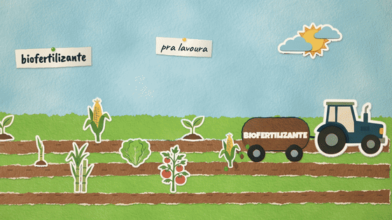
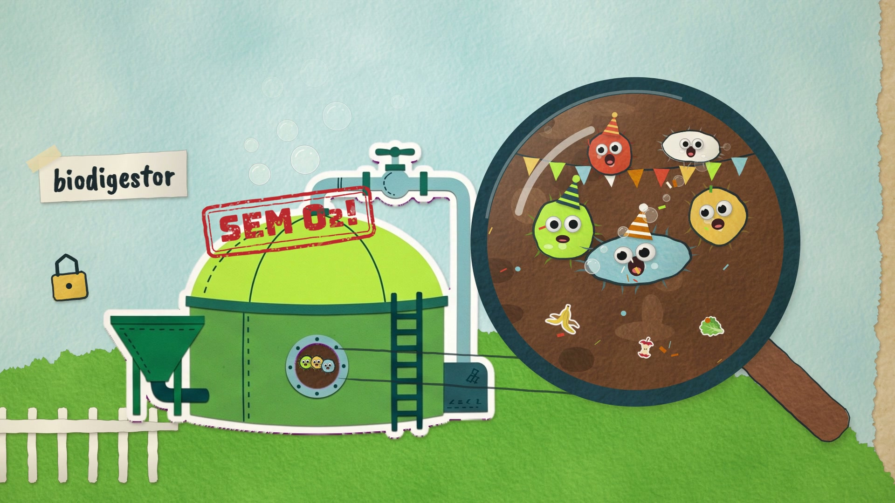
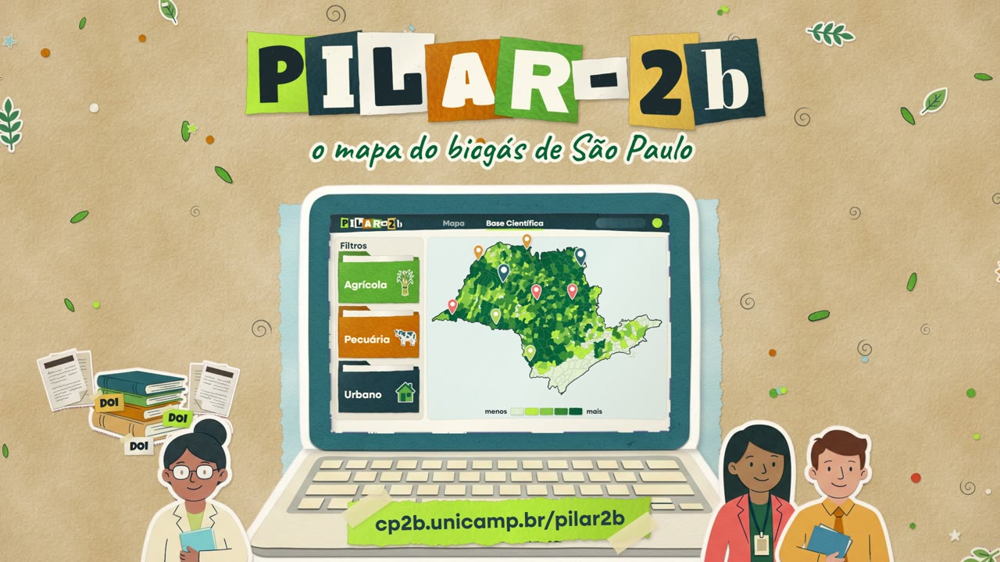
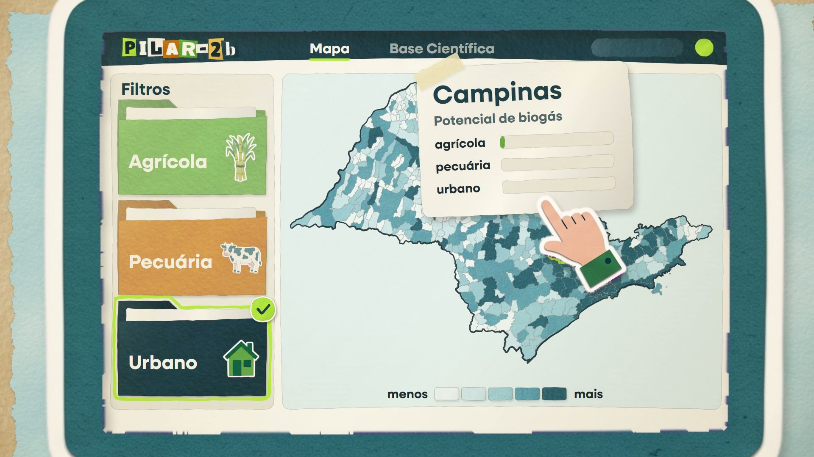

# educa CP2B

Animações educativas do **CP2B — Centro Paulista de Estudos em Biogás e Bioprodutos** (NIPE‑Unicamp),
feitas em código: uma "mesa de colagem" em JavaScript que desenha papel recortado, fita crepe, carimbos
e traço à mão quadro a quadro, sincronizada palavra a palavra com a narração.

## 01 · O que é biogás? E biometano?

<p align="center"></p>

**57 s · 24 qps · pt-BR** · 16:9 (1920×1080) e **9:16 para Stories/Reels (1080×1920)** · baixar na [Release v1.0](https://github.com/aikiesan/educa_cp2b/releases/tag/v1.0):

| versão | arquivo |
|---|---|
| principal (duas vozes) | [`o-que-e-biogas.mp4`](https://github.com/aikiesan/educa_cp2b/releases/download/v1.0/o-que-e-biogas.mp4) · H.264 9 Mb/s + AAC 256 kb/s |
| com legendas embutidas (redes sociais) | [`o-que-e-biogas_legendado.mp4`](https://github.com/aikiesan/educa_cp2b/releases/download/v1.0/o-que-e-biogas_legendado.mp4) |
| narração com uma voz (Sulafat) | [`o-que-e-biogas_voz-unica.mp4`](https://github.com/aikiesan/educa_cp2b/releases/download/v1.0/o-que-e-biogas_voz-unica.mp4) |
| vertical 9:16 (Stories/Reels) | [`o-que-e-biogas_vertical.mp4`](https://github.com/aikiesan/educa_cp2b/releases/download/v1.0/o-que-e-biogas_vertical.mp4) |
| vertical 9:16 com legendas | [`o-que-e-biogas_vertical_legendado.mp4`](https://github.com/aikiesan/educa_cp2b/releases/download/v1.0/o-que-e-biogas_vertical_legendado.mp4) |
| master (CRF 16, para edição/arquivo) | [`o-que-e-biogas_master.mp4`](https://github.com/aikiesan/educa_cp2b/releases/download/v1.0/o-que-e-biogas_master.mp4) |

Legendas [`.vtt`](videos/01-o-que-e-biogas/legendas.pt-BR.vtt) / [`.srt`](videos/01-o-que-e-biogas/legendas.pt-BR.srt) ·
roteiro, storyboard e checagem de conteúdo em [`videos/01-o-que-e-biogas/roteiro.md`](videos/01-o-que-e-biogas/roteiro.md) ·
capa [`docs/capa.jpg`](docs/capa.jpg)

<p align="center"></p>

Sete estações de papel rasgado dispostas em anel ao redor de um laboratório: sobras → biodigestor
(a festa dos micróbios, vista por uma lupa) → composição do biogás → calor e eletricidade → purificação
→ biometano no gasoduto, em casas, indústrias, caminhões e ônibus → biofertilizante na lavoura. Em
*"fechando o ciclo!"* a câmera se afasta e revela o círculo inteiro; o filme termina no logo CP2B.

### Assistir no navegador (com áudio e legendas)

```bash
npm install
npm run servir
```

Abra <http://127.0.0.1:8080/videos/01-o-que-e-biogas/> (espaço = play/pausa; botão CC = legendas).
A página desenha a animação em tempo real no `<canvas>`, sincronizada ao áudio.

## 02 · PILAR-2b: o mapa do biogás de São Paulo

<p align="center"></p>

**58 s · 24 qps · pt-BR · uma voz (Sulafat)** · 16:9 (1920×1080) e **9:16 para Stories/Reels (1080×1920)** ·
baixar na [Release v2.0](https://github.com/aikiesan/educa_cp2b/releases/tag/v2.0):

| versão | arquivo |
|---|---|
| principal 16:9 | [`pilar-2b.mp4`](https://github.com/aikiesan/educa_cp2b/releases/download/v2.0/pilar-2b.mp4) · H.264 9 Mb/s + AAC 256 kb/s |
| com legendas embutidas 16:9 | [`pilar-2b_legendado.mp4`](https://github.com/aikiesan/educa_cp2b/releases/download/v2.0/pilar-2b_legendado.mp4) |
| vertical 9:16 (Stories/Reels) | [`pilar-2b_vertical.mp4`](https://github.com/aikiesan/educa_cp2b/releases/download/v2.0/pilar-2b_vertical.mp4) |
| vertical 9:16 com legendas | [`pilar-2b_vertical_legendado.mp4`](https://github.com/aikiesan/educa_cp2b/releases/download/v2.0/pilar-2b_vertical_legendado.mp4) |
| master 16:9 (CRF 16, para edição/arquivo) | [`pilar-2b_master.mp4`](https://github.com/aikiesan/educa_cp2b/releases/download/v2.0/pilar-2b_master.mp4) |

Legendas [`.vtt`](videos/02-pilar-2b/legendas.pt-BR.vtt) / [`.srt`](videos/02-pilar-2b/legendas.pt-BR.srt) ·
roteiro, storyboard e checagem de conteúdo em [`videos/02-pilar-2b/roteiro.md`](videos/02-pilar-2b/roteiro.md)

<p align="center"></p>

Um único **mapa de papel de São Paulo** — os 645 municípios recortados da malha do IBGE, desenhados em código —
começa na mesa, voa para a tela de um notebook de papel e vira a plataforma: pastas de dados (Agrícola,
Pecuária, Urbano) entram no painel **Filtros**, o mapa se pinta de oeste para leste com o potencial de cada
município, a mãozinha clica em *Urbano* e em *Campinas* e sobe o cartão de resultado. As cores vêm dos dados
reais do PILAR-2b (`02_municipality_summary_SP_2023.csv`, classes por quintil) e **nenhum número aparece na tela**.

Assistir no navegador: <http://127.0.0.1:8080/videos/02-pilar-2b/> — versão vertical com `?formato=vertical`.

## Como é feito

> **Manual de produção:** [`docs/METODO.md`](docs/METODO.md) — passo a passo de um episódio (roteiro, pedidos de
> imagem/voz/música, recortes, alinhamento, partitura, cena, formato vertical, marca, mixagem, render, QA, Release),
> convenções e armadilhas conhecidas.

| etapa | ferramenta | arquivo |
|---|---|---|
| ilustrações recortadas (vaca, biodigestor, máquina, veículos, plantas…) | Nano Banana 2 (Gemini), fundo magenta | `entrada/imagens/` → `tools/preparar_ativos.py` (recorte por chroma key, "defringe", separação de itens) → `assets/recortes/` |
| papel, bordas rasgadas, sombras, traço à mão, letras recortadas, carimbos, micróbios, moléculas | motor próprio `lib/colagem/` (canvas 2D determinístico) | `core.js`, `paper.js`, `shapes.js`, `ink.js`, `sprite.js`, `text.js`, `extras.js`, `stage.js` |
| narração (ep. 01: Sulafat e Puck · ep. 02: Sulafat) | Gemini 3.8 Flash TTS | `entrada/biogas_multispeaker.wav`, `entrada/pilar2b_sulafat_take2.wav` (roteiros em `videos/*/roteiro.json`) |
| alinhamento palavra a palavra | torchaudio MMS forced aligner | `tools/audio/alinhar_vo.py` → `audio/vo_alinhamento.json` |
| partitura (tempos de cada palavra, grade de compassos, logo na batida final) | — | `videos/*/partitura.json` → `tools/audio/montar_timeline.py` → `videos/*/timeline.json` |
| trilhas "The Papercut Invention" (ep. 01) e "Sunlight on the Workbench" (ep. 02) | Lyria 3 Pro | editadas em compasso inteiro (ep. 01: corte de 4 compassos; ep. 02: sem corte, logo no golpe final) |
| mapa de SP (645 municípios, classes de potencial) | malha IBGE + dados do PILAR-2b | `tools/dados/mapa_sp.py` → `videos/02-pilar-2b/dados/sp_mapa.json` |
| efeitos sonoros (papel, pops, bolhas, mola, carimbo, fogo, sinos, máquina, trator, clique, alfinete…) | sintetizados do zero | `tools/audio/sfx.py` (eventos exportados pela própria cena: 146 no ep. 01, 114 no ep. 02) |
| mixagem (ducking sob a voz, EQ, compressão, −15 LUFS, pico real ≤ −1 dBTP) | pedalboard + pyloudnorm + Rubber Band | `tools/audio/mixar.py` → `audio/mix.wav`, `audio/mix.m4a` |
| render quadro a quadro (com desfoque de movimento nas viradas de câmera) | Playwright + Chromium (GPU) + ffmpeg (x264) | `tools/render.mjs` |

As versões de distribuição levam o **logo CP2B no canto** (cartão branco limpo, desenhado depois do grão e da luz,
conforme o manual da marca); ele sai antes do título final. Os masters ficam sem marca, para edição.

A animação é **função pura do tempo**: o mesmo instante gera sempre o mesmo quadro. Todas as deixas
visuais e sonoras são ancoradas em palavras da narração (`at('L03', 'micróbios')`), então trocar a
narração e rodar o pipeline de novo re-sincroniza tudo.

### Refazer um vídeo

Os scripts recebem o episódio (`--video 02-pilar-2b`; sem ele, o ep. 01). Exemplo do ep. 02:

```bash
python tools/dados/mapa_sp.py                                         # mapa de SP (precisa do repositório Pilar-2b)
python tools/preparar_ativos.py ep02 GERACAO_FINAL_MELHOR && python tools/nomear_ep02.py && python tools/meta_recortes.py ep02
python tools/audio/alinhar_vo.py entrada/pilar2b_sulafat_take2.wav --video 02-pilar-2b
python tools/audio/montar_timeline.py --video 02-pilar-2b
python tools/legendas.py videos/02-pilar-2b/timeline.json --balancear
npm run sfx:02 && python tools/audio/mixar.py --video 02-pilar-2b && python tools/audio/grafico_mix.py --video 02-pilar-2b
npm run render:02                                                     # master 16:9; vertical: --query formato=vertical
```

Ep. 01:

```bash
# 1. ambiente Python (ferramentas de áudio/imagem)
python -m venv .venv && .venv/Scripts/pip install -r tools/requirements.txt
# 2. (se trocar as ilustrações) recortar os PNGs
python tools/preparar_ativos.py
# 3. (se trocar a narração) alinhar e montar a partitura
python tools/audio/alinhar_vo.py entrada/biogas_multispeaker.wav      # requer torch + torchaudio
python tools/audio/montar_timeline.py
python tools/legendas.py
# 4. exportar as deixas de efeitos e mixar
npm run sfx
python tools/audio/mixar.py
# 5. renderizar
npm run render
```

Variações pela URL da página (nos dois episódios): `?formato=vertical` (9:16, 1080×1920), `?marca=0` (sem a
marca-d'água do CP2B no canto — usada nos masters), `?cc=1` (legendas desenhadas no quadro), `?tl=timeline_single.json&audio=audio/mix_single.m4a`
(versão com uma voz). Para a versão de uma voz: `montar_timeline.py --alinhamento audio/vo_alinhamento_single.json --tempo 1.05 --pausas 0.8 --saida .../timeline_single.json`.
A codificação de distribuição (2 passagens, ~9 Mb/s) está em `tools/codificar.sh` (use `--keep` no render para manter os quadros PNG).

A fonte da marca (Neulis Sans) tem licença comercial e **não** está no repositório: coloque os `.otf`
em `assets/fonts/licenciadas/` (ignorado pelo git). Sem ela, o slogan final usa uma fonte livre.

`tools/audio/tts_qwen.py` e `tts_voxcpm.py` são alternativas locais de narração (Qwen3-TTS / VoxCPM2, Apache-2.0),
e `avaliar_vo.py` pontua tomadas (WER, sotaque PT-BR, MOS) — não usados na versão final, que usa Gemini TTS.

## Créditos e licenças

Ver [`CREDITOS.md`](CREDITOS.md).
